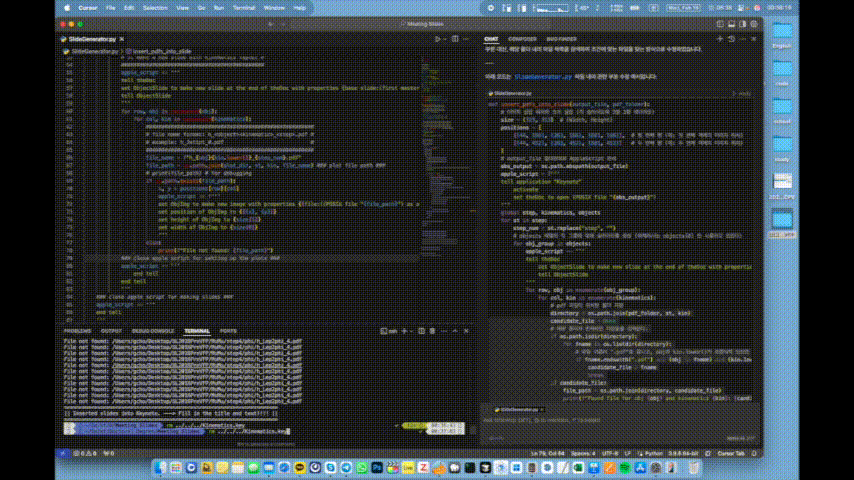

# **SildeGenerator v1.0**
- This tool helps automatically insert plots into Keynote slides. 
- It was created to easily insert the kinematics of jets and leptons at each step in ttbar in dilepton channel analysis. 
- Plots will be arranged in a 2 x 3 layout. 


# **How it works**
1) Copy the template file.
2) Open the copied file using AppleScript.
3) Duplicate 1st slide.
4) Find files and set up the size & position.

# **Note**
- The slide will be filled with plots starting from the second page. (The first page is used for copying pages and should be removed after running)
- All plots are not arranged in the correct order. You need to modify their placement.
- You must write the title and content for each page.

# **Requirement**
- Keynote & Mac OS to use 'Apple script'
- Python
- Template file

# **Description**
## Configuration section
```python
#################
# Configuration #
#################
### template & output file ###
template_file = "./KinematicTemplate.key"
output_file = "../../../Kinematics.key"
### the path where the plot files are located & what is the version ###
version = "SelLep"
sample = "TTbar_Signal"
base_dir = "/Users/gcho/Desktop/"
plot_dir = base_dir + version +"/Dataset/UL2016PreVFP/MuMu/" + sample + "/"

### event selection step ###
step = [
    #"initial", 
    "step0", "step1", 
    #"step2", "step3", "step4", "step5", "step6"
    ]
### kinematic variables ###
kinematics = ["pt", "eta", "phi",
              #"iso"
              ]
### objects ###
objects = [
    #["AllSelMu", "AllSelVetoEle"],
    ["Lep1", "Lep2"],
    #["Jet1", "Jet2"],
    ]
```
## Plots size and position
```python
size = (323, 313)                              # (Width, Height)
    positions = [
        [(44, 166), (363, 166), (681, 166)],   # positions of the first row : Jet1 & Lep1 in this case
        [(44, 452), (363, 452), (681, 452)]    # positions of the second row : Jet2 & Lep2 in this case
    ]
```
## File name format
```python
#######################################################
# file name format: h_<object>_<kinematic>_<step>.pdf #
# example: h_Jet1_pt_0.pdf                            #
#######################################################
file_name = f"h_{obj}_{kin.lower()}_{step_num}.pdf"
file_path = os.path.join(plot_dir, st, kin, file_name) ### plot file path ###
```
- **All plots you want to insert must be in the same format**
